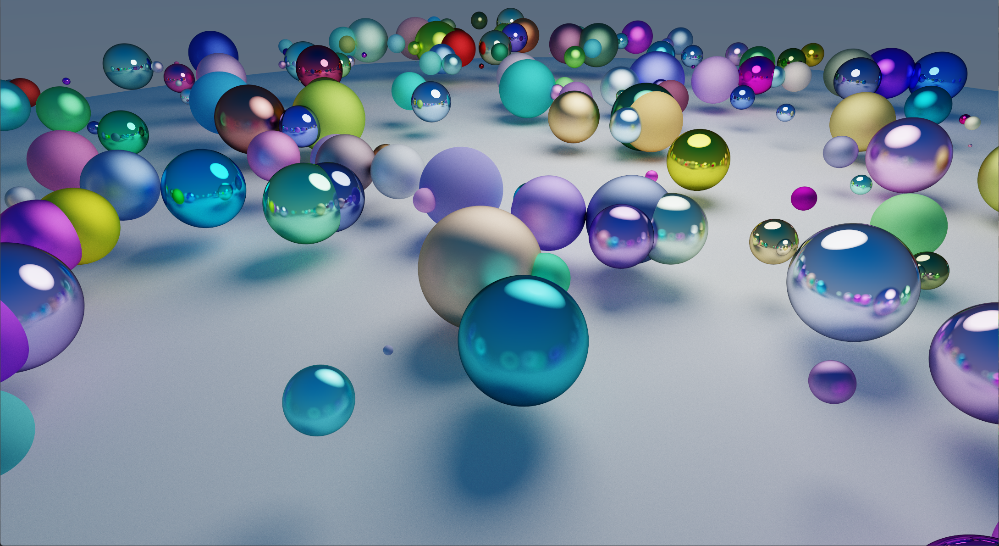

# ☄️ Simple Path Tracer

<p align="center">
    
</p>


**A personal exploration of light physics and OpenGL Compute Shaders.**

## 📌 Project Goals
The goal of this project was to understand the fundamentals of Path Tracing by building a renderer from scratch. Instead of using standard rasterization, this engine simulates how light rays actually bounce in a 3D environment to produce natural shadows and reflections.

## 🔬 Tech Details
- Language: C++
- Graphics: OpenGL 4.6
- Math: GLM
- Features: SSAA (Anti-aliasing), Progressive Rendering, Spherical Intersections.

## 🛠️ Build from source

### ❗ Requirements
- C++ Compiler: Support for C++20 (GCC, Clang, or MSVC).
- Graphics Card: A GPU supporting OpenGL 4.6 (specifically for Compute Shader support).
- CMake
- Git

### 📦 Installation

1. Clone the project:

   ```bash
   git clone https://github.com/RomainPlmg/RayTracer.git
   cd RayTracer
   ```

2. Create a build directory and generate the build files:
    ```bash
    mkdir build
    cd build
    cmake ..
    ```
3. Build the project
    ```bash
    ninja
    ```
4. Run the engine
    ```bash
    ./RayTracer
    ```

## ⚙️ How it's built
- **Compute Shaders**: All calculations are done on the GPU for real-time feedback.

- **Monte-Carlo Integration**: Uses random ray bounces to calculate global illumination and soft shadows.

- **Materials**: Basic support for color, light emission, and surface roughness (from matte to mirror).

- **Accumulation**: Since path tracing is noisy, the engine averages multiple frames to "clear" the image over time.

- **Post-Processing**: Includes a basic Reinhard tone mapper and gamma correction to keep colors looking natural.

## 📚 Credits & Resources
* Special thanks to [**Sebastian Lague**](https://www.youtube.com/c/SebastianLague) for his amazing series on "[Coding Adventure: Ray Tracing](https://www.youtube.com/watch?v=Qz0KTGYJtUk)", which provided the mathematical foundation for this project.
* The [**LearnOpenGL.com**](https://learnopengl.com/) community for their tutorials.

## 📜 License
This project is licensed under the MIT License – see the [LICENSE](LICENSE) file for details.